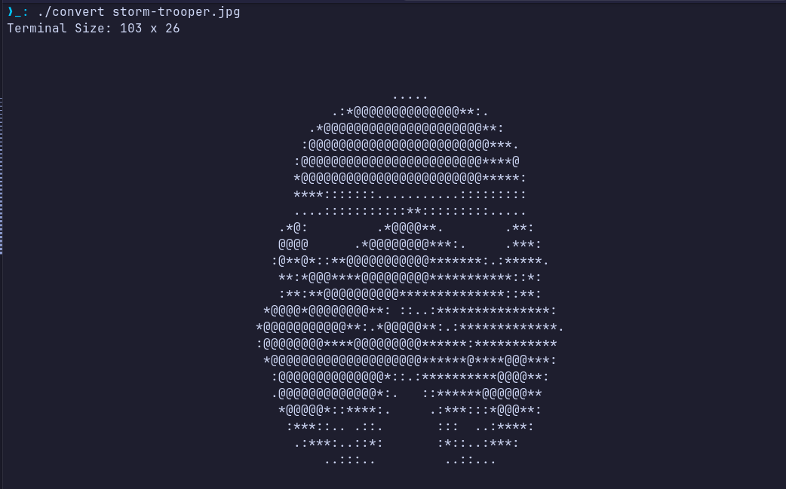

# ASCII-PAINTER

A minimalist CLI ASCII image converter written in C.
Image size adapts to terminal size.
Made because I wanted my own ASCII wallpapers lol.
Fun weekend project!



## REMARKS

- Image parser library from: https://github.com/nothings/stb?tab=readme-ov-file
- Not really meant for public usage

## INSTALL

Not meant for public use but you can clone this repo and compile with the makefile

```bash
git clone https://github.com/ed1-ble/ascii-painter
cd ascii-painter
make
